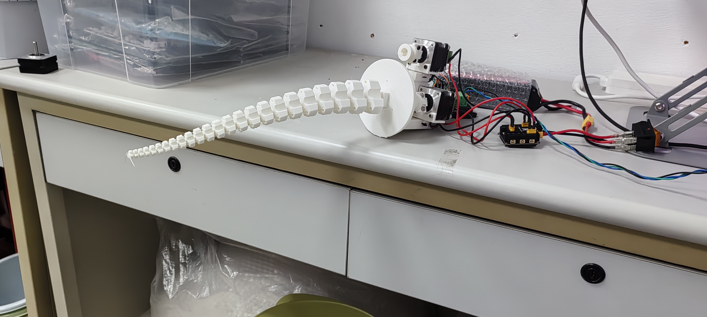
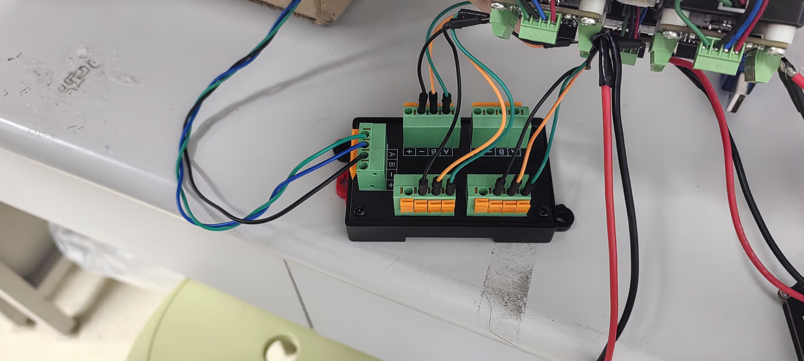
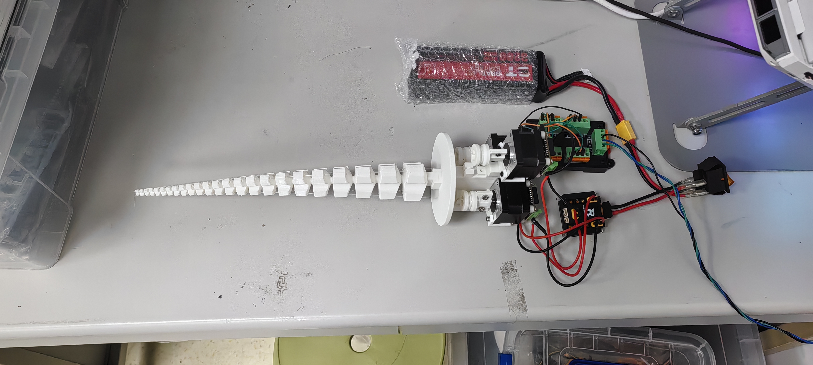

# SpiRob：基于螺旋的绳驱动连续体机器人



# Demo

## 自由度展示

<div align="center">
<video src="assets/9526db5b57d2561ed2bb14f524f04206.mp4" controls>
</video>
</div>
[▶️ 观看演示](assets/9526db5b57d2561ed2bb14f524f04206.mp4)

## 自上方抓取


<div align="center">
<video src="assets/f60d8ddacf6bd0dd3aa59eea5b679a06.mp4" controls>
</video>
</div>


## 自下方抓取


<div align="center">
<video src="assets/f35791782b6c41cc7f417259455922a4.mp4" controls>
</video>
</div>


# 3D Model Generation

OpenSpiRobs is a research toolkit for designing and simulating logarithmic‑spiral soft robots. It provides a GUI design tool for rapid geometry iteration, CAD export (STEP/STL), and MuJoCo XML generation, plus a real‑robot control stack (`real_deploy/`) driving cable‑driven tendons over RS485, with optional modules for fabrication and datasets.


## Structure

- `design-tool/` — Python GUI design tool (primary). See `design-tool/README.md` for usage.
- `real_deploy/` — real‑robot control over RS485 (三绳触手联动控制). See [真机控制 (real_deploy/)](#真机控制-real_deploy) below.
- `hardware/` — hardware CAD/STEP/STL (optional)
- `fabrication/` — fabrication/assembly notes (optional)
- `datasets/` — datasets/models (optional)

---

# Real World Deployment

用 RS485 (MKS 自定义协议) 驱动三台 MKS SERVO D 系列闭环步进电机, 每台绕一个线盘收/放一根绳,
牵引 SpiRob 软体机器人弯曲到指定姿态。

| 文件                             | 作用                                                                            |
| -------------------------------- | ------------------------------------------------------------------------------- |
| `real_deploy/mks_servo.py`     | 底层驱动:`MksBus` (一条 485 总线) + `MksServo` (单台电机)。帧/校验/各指令。 |
| `real_deploy/spirob.py`        | 三绳位置控制层 `SpiRob` + 交互式控制台 (`python real_deploy/spirob.py`)。   |
| `real_deploy/requirements.txt` | 依赖 (仅 `pyserial`)。                                                        |

协议依据: 《MKS SERVO42&57D 闭环步进电机 RS485 使用说明 v1.0.9》
(见 `docs/MKS D系列闭环步进驱动器/04_说明书/`)。

## 硬件配置

- 三台电机已通过**同一个** USB-转-485 适配器挂在**同一条总线**上 (A-A、B-B 并联, 末端 120Ω 跳线)：

  
- 用12-24V的锂电池供电，经过分电板（此处使用RM电调中心板）分成3路给电机分别供电：

  
- 电机背部驱动板接线图：

  
- 三台电机的 485 从机地址分别为 **1 / 2 / 3。**
  电机物理编号：触手面相自己，左下角电机为1号，右下角电机为2号，中间电机为3号

  **绳↔电机映射默认 `--addrs 1,3,2`**(绳1→电机1, 绳2→电机3, 绳3→电机2)

  接线不同就用 `--addrs` 改。
- 波特率为出厂默认 **38400** (若改过, 运行时加 `--baud`)。
- Linux 下当前用户在 `dialout` 组 (本机已满足), 故无需 sudo 即可访问 `/dev/ttyUSB*`。

## 依赖

```bash
python -m pip install -r real_deploy/requirements.txt
```

## 快速开始

```bash
python real_deploy/spirob.py                 # 默认 /dev/ttyUSB0 @ 38400, 绳→电机 1,3,2
python real_deploy/spirob.py --port /dev/ttyUSB0 --baud 38400 --addrs 1,3,2
```

启动后自动初始化 (设为总线 FOC 模式 `SR_vFOC` + 干净应答 + 使能), 进入控制台。

**标准上手流程**:

1. `j 1 60` … `j 1 0`：逐根点动 (jog), 把绳的松弛量收掉到"刚好绷直"。同时确认**正 rpm 是否对应收紧**;
   若相反, 退出后用 `--dirs` 把那一路设成 `-1` (例 `--dirs 1,-1,1`)。
2. `z`：在这个中性/绷直姿态**置零**。之后所有 `p`/`m` 的绝对拉入量都以此为基准。
3. `p 0.3 0 0`：让 1 号绳收紧 0.3 圈, 另两根回到 0 → 机器人朝对应方向弯。`r` 查看实际坐标。
4. `p 0 0 0`：回到中性。`relax`：松轴休息。`q`：松轴并退出。

> 控制台命令一览: 启动后输入 `?`。

## 键盘交互式直控

像遥控一样实时驱动。有两种模式, 都是单键即时、tmux 下可用:

### 触手联动 —— `t` / `--tentacle`

把整条触手当作 **3 自由度** 开: 弯曲方向 + 弯曲大小 (2 DOF) + 整体收缩 (1 DOF)。
三根绳由恒曲率腱驱动映射 **自动协调收放**, 不再各自单独控制。

```bash
python real_deploy/spirob.py --tentacle      # 或在命令行里输入 t
```

```
  w / s   向 +Y / -Y 弯 (前/后倾)       a / d   向 -X / +X 弯 (左/右倾)
  i / k   整体收紧 / 放松 (收缩)         space   回正 (弯曲归零)
  0       全部归零                       z       当前姿态置零
  - / =   弯曲步长 ∓                     , / .   速度 ∓10 RPM
  [ / ]   放线指数 ∓ (大=小弯曲少放线)    r       打印状态
  Ctrl+C  急停 (留在模式内)              q       退出
```

- WASD 就是"触手往哪倒"; 第 i 根绳拉入量 = `bx·cos(βi) + by·sin(βi) + c`。
- 弯曲项三绳和为 0 (纯弯曲不改总长), 收缩 `c` 是公共项; 任一根超 `--max-pull` 会**整体等比缩小、保持弯曲方向**。
- **收放不对称 (放线指数 `--payout-exp`, 默认 2.0)**: 收线侧线性, 放线侧 ∝ 弯曲量^exp ——
  小弯曲时放线很少 (绳不松), 弯曲越大才逐渐放足; `=1` 退回线性对称。模式内 `[`/`]` 可实时调。
- 命令行里也能一次摆位: `b <bx> <by> [c]` (如 `b 0.3 0 0`)。
- 三绳安装角默认 `210,90,330` (绳1=8点, 绳2=12点, 绳3=4点, 互成 120°)。若 WASD 方向/朝向不对,
  用 `--cable-angles` 调, 或用 `--dirs` 翻某根绳的收紧方向。

### 单绳直控 —— `k` / `--keys`

逐根绳收放, 用于调试 / 找零位 / 确认绕向:

```
  收紧 +  u i o   放松 -  j k l   space 停   0 回中性   z 置零
  - / = 步长   , / . 速度   r 状态   x/g 松/锁轴   Ctrl+C 急停   q 退出
```

两种模式通用:

- **按住**键 = 持续动; **松开即停** (连发自动合并, 无拖尾)。采用增量位置目标 (F5 绝对坐标), 按 `--max-pull` 截断。
- **tmux 下可用**: 直接在窗格里跑。退出只认 `q` (不用 Esc——避免 tmux `escape-time` 把方向键/Esc 拆开误退); 方向键被忽略。
- 需要真实终端 (TTY); 被管道/重定向时会提示无法使用。

## 控制原理

触手联动模式的完整链路:

```
按键 WASD / ik                每次按下: 弯曲向量 ±step, 收缩 ±step (按住=连发=连续; 松开冻结)
      │
      ▼
弯曲状态 (bx, by, c)          bx,by = 弯曲向量(方向+大小), c = 整体收缩
      │   ① 恒曲率腱驱动映射
      ▼
三绳线性拉入量  pull_i = bx·cos(βi) + by·sin(βi) + c
      │   ② 放线非线性整形 (只压"放线"侧, 收线不动)
      ▼
三绳整形后拉入量
      │   ③ 协调截断 (超 max_pull 整体等比缩小, 保形)
      ▼
三绳目标(圈)
      │   ④ coord = round(dir_i · 目标 · 16384), 发 F5 坐标绝对
      ▼
   电机
```

**① 恒曲率映射 (弯曲 → 三绳)** — 绳 i 装在触手横截面角度 βi (默认 8/12/4 点 = 210/90/330°):

```
pull_i = bx·cos(βi) + by·sin(βi) + c  =  m·cos(βi − φ) + c
         其中 m = √(bx²+by²) 弯曲量,  φ = atan2(by, bx) 弯曲方向
```

弯曲项三绳和为 0 (纯弯曲、不改总长), c 是公共项 (整体收缩)。朝某根绳弯 = 收紧那根、放松另两根。

**② 放线非线性整形 (核心)** — 线性映射里收线和放线幅度一样大 → 放线侧很快放过头/松掉。
于是**只对放线 (负向) 分量**按弯曲量衰减、**收线侧保持线性**:

```
α(m) = min(1, m / max_pull) ^ (payout_exp − 1)     # payout_exp 默认 2; =1 即线性对称
放线分量' = 放线分量 × α(m)
```

效果: 放线量 ∝ m^payout_exp (超线性) —— 小弯曲时几乎不放线 (绳保持张紧), 弯曲越大才逐渐放足,
m 到上限时回到线性满值。收/放比随弯曲增大而下降 (朝绳2 弯, 绳2 收、绳1/3 放; exp=2):

| 弯曲 m (圈)  | 0.2    | 0.6     | 1.0    |
| ------------ | ------ | ------- | ------ |
| 收线 (绳2)   | +0.20  | +0.60   | +1.00  |
| 放线 (绳1/3) | −0.02 | −0.18  | −0.50 |
| 收 : 放      | 10 : 1 | 3.3 : 1 | 2 : 1  |

模式内 `[`/`]` 实时调 `payout_exp`, 或命令行 `--payout-exp`。

**③ 协调截断** — 若任一根超过 `max_pull`, 三根**等比缩小**而非单独削顶, 保持弯曲方向/形状。

**④ 三绳 → 电机** — 目标(圈) → `coord = round(dir_i × 目标 × 16384)`, 发 `F5` 坐标绝对运动
(16384 = 1 圈, 与细分无关; `dir_i = ±1` 翻线盘绕向)。F5 支持运动中实时更新, 故连发的按键 = 平滑跟随的目标流。

> **单绳模式** 跳过 ①②③: `u/i/o`、`j/k/l` 直接增量每根绳的目标(圈), 线性、各自独立。

## 诊断、校准、回零

**本工具的软件上限 `max_pull`** (默认 **1.0 圈**)。用 `p`/`m`/键盘做位置控制时, 目标会被截断到 ±`max_pull`, 看起来就像对称限位。**点动 `j` / 键盘连发的速度模式不受它限制**。

想放大: 启动时加 `--max-pull 3` (按你的线盘/绳长标定后再放大)。

`diag` 命令把第 2 类一次读出来:

```
spirob> diag
--- 电机 addr 0x1 ---
  运行状态 : 停止    使能: 锁轴    堵转: 正常
  当前坐标 : +0.512 圈 (8389)    转速 +0 RPM    角度误差 +0.3°
  限位输入 : IN_1(左限/回零)=0  IN_2(右限)=0
  配置     : 限位使能(EndLimit)=关  限位重映射=关  堵转保护=关
  ▶ 未见电机侧限位/堵转。若用位置控制, 多半是软件 max_pull=1.0圈 截断 ...
```

读到的内容: 运行状态、当前坐标(圈)、转速、是否使能/堵转、角度误差、限位开关输入(IN_1/IN_2)、
以及 `EndLimit 限位` / `限位重映射` / `堵转保护` 是否开启 (后三项需固件 ≥ V1.0.6 的 47H 整包读取)。
**电机停下后立刻 `diag`**: 坐标就是它停在哪一圈, 堵转标志/使能状态就能区分是"被保护停"还是"到目标停"。

### 校准编码器 (`cal`) 与回零 (`home`)

- `cal` —— 对应 Windows 上位机的 **Cal** 按钮 (指令 `80H`), 重新学习磁编码器零位。
  > ⚠️ **校准时电机会自转约一圈, 必须空载 / 先松开绳**! 带载校准会拉坏软体本体, 也会校歪。
  > 命令会要求输入 `yes` 确认, 完成后可选择回到坐标 0。
  >
- `home` —— 三绳回到**坐标 0** (即上次 `z`/`set_zero` 设的零点), 用 `F5` 绝对运动。
- 库用法: `robot.calibrate_all(return_to_zero=True)`、`robot.go_zero_all()`、`robot.diagnose()`。

推荐流程: 松开绳 → `cal`(逐台校准) → 装回/绷紧绳 → `z` 在中性姿态置零 → 正常 `p`/键盘控制;
之后任何时候 `home` 都能回到该零点。

### 工作电流 (`cur` / `--current`)

加大电流 = 更大力矩(绳张力扛得住、不易丢步/堵转), 但发热更多、对软体的力也更大。指令 `83H`。

```bash
python real_deploy/spirob.py --current 1200    # 启动时把三台都设成 1200 mA
# 控制台里:
#   cur          查看三台当前工作电流
#   cur 1200     设成 1200 mA (写 flash 保持)
```

- 各型号默认: **35D 800** / 42D 1600 / 57D 3200 / 28D 600 (mA)。FOC 模式下这是电流上限。
- ⚠️ **别超你电机的额定值** (看 35D 电机标签/手册), 也**别设到最大值**——电流波动可能烧驱动板。从小幅往上加。
- 库用法: `robot.set_current_all(1200)`、`servo.set_current(1200, save=False)` (仅本次不写 flash)。

## 安全须知 ⚠️

- **从小量、低速开始**: 首次每根绳 `0.1–0.3` 圈、速度默认 120 RPM。软体本体和绳都容易被拉坏。
- `--max-pull` 是每根绳的**软上限 (圈)**, 默认 1.0。**必须**按你的线盘半径/绳长标定后再调大;
  代码会按它截断 `p`/`m` 的目标, 防止手误打成大数字直接拉断。
- 绝对位置以 `z` 的姿态为零点。**务必在松弛/中性姿态下 `z`**, 否则零点漂移会让首条 `p` 猛拉。
- 空闲时 `relax` 松轴, 避免持续张力 / 堵转发热。
- 紧急情况随时按 **Ctrl+C** 急停 (立即停全部电机, 仍留在控制台), 或直接断电。

## 作为库使用

```python
from mks_servo import MksBus
from spirob import SpiRob

bus = MksBus("/dev/ttyUSB0", 38400)
robot = SpiRob(bus, addresses=(1, 3, 2), directions=(1, 1, 1),
               max_pull=1.0, cable_angles_deg=(210, 90, 330), payout_exp=2.0)
robot.setup()                  # SR_vFOC + 使能
# robot.set_current_all(1200)  # 可选: 加大工作电流(mA)
robot.set_zero_here()          # 当前姿态置零 (先确保松弛/绷直)
robot.set_bend(0.3, 0.0)       # 触手联动: 朝 +X 弯 (协调三绳)
robot.set_pull((0.3, 0.0, 0.0))  # 或: 直接给三绳绝对拉入量(圈)
print(robot.read_pull())       # [圈, 圈, 圈]
robot.relax(); bus.close()
```

> 直接运行 `python real_deploy/spirob.py` 时, 脚本目录已在 `sys.path` 中, 故 `import mks_servo` 可用;
> 在别处当库用, 把 `real_deploy/` 加入 `PYTHONPATH` 即可。

单台电机也可直接用底层驱动:

```python
from mks_servo import MksBus, MksServo, MODE_SR_vFOC
m = MksServo(MksBus("/dev/ttyUSB0", 38400), addr=1)
m.set_work_mode(MODE_SR_vFOC); m.enable(True); m.set_zero()
m.move_abs_rev(0.5, speed=120)   # 绝对转到 0.5 圈
print(m.read_rev())
```

## RS485 协议速查 (v1.0.9, 已对照手册示例核对)

帧: `FA addr code data… checksum` (下行) / `FB addr code data… checksum` (上行);
数据**大端**; `checksum = sum(前面所有字节) & 0xFF`; 地址 `0x00`=广播(不应答), 默认 `0x01`。
坐标(累加多圈编码器值)**16384 = 1 圈**, 与细分无关; 16 细分时 3200 脉冲/圈。

| 功能            | code          | 关键数据                     | 备注                                               |
| --------------- | ------------- | ---------------------------- | -------------------------------------------------- |
| 设工作模式      | `82`        | mode (`05`=SR_vFOC)        | 串口控制必须 SR_xxx; 出厂 `02`=CR_vFOC; 写 flash |
| 设应答方式      | `8C`        | XX YY (`01 00`)            | 本驱动用"有应答+不主动回完成帧"                    |
| 使能/松轴       | `F3`        | `01`/`00`                | 仅总线模式                                         |
| 设零点          | `92`        | —                           | 绝对运动前必须                                     |
| 坐标绝对运动    | `F5`        | speed(2B) acc int32坐标      | 主用; 支持运动中实时更新                           |
| 坐标相对运动    | `F4`        | speed(2B) acc int32增量      |                                                    |
| 速度模式        | `F6`        | dirspeed(2B) acc             | byte4 bit7=方向; 停=`F6 00 00 acc`               |
| 紧急停机        | `F7`        | —                           | >1000RPM 不建议                                    |
| 读坐标          | `31`        | →int48                      | 收紧/姿态反馈                                      |
| 读转速          | `32`        | →int16 RPM                  |                                                    |
| 读使能          | `3A`        | →`01`/`00`              |                                                    |
| 读运行状态      | `F1`        | →0..6                       | 1=停止 (用于等待运动完成)                          |
| 设从机地址      | `8B`        | new addr                     | 单独接一台时用; 写 flash                           |
| 设波特率        | `8A`        | 档位                         | `04`=38400(默认) `06`=115200                   |
| 设工作电流      | `83`        | current(2B mA)[+`00`=不存] | FOC 下为电流上限; 35D 默认 800                     |
| 校准编码器      | `80`        | `00`                       | 对应上位机 Cal;**空载!**                     |
| 读 IO/限位      | `34`        | →位域                       | bit0=IN_1左限/回零 bit1=IN_2右限                   |
| 读角度误差      | `39`        | →int32                      | 51200=360°                                        |
| 读堵转          | `3E`        | →`01`/`00`              | 1=堵转;`3D` 解除                                 |
| 读全部配置/状态 | `47`/`48` | →整包                       | 限位/保护/电流/坐标 等 (固件≥1.0.6)               |

> 注意: 运动类指令 (`F4/F5/F6/FD/FE`) 只在总线模式 (`SR_OPEN/SR_CLOSE/SR_vFOC`) 下有效。

## 故障排查

- **找不到 `/dev/ttyUSB0`**: `ls /dev/ttyUSB*`; 插上适配器后看 `dmesg | tail` 确认是 ch340/ftdi/cp210x;
  若枚举成别的号 (如 `ttyUSB1`), 用 `--port` 指定。
- **应答超时/不完整**: 多半是波特率不符 (默认 38400, 不是 115200) 或地址不存在; 也检查 A/B 是否接反、
  总线末端 120Ω 跳线。
- **收到的字节像是自己发出去的**: 适配器不是自动收发方向 (回显), 换 MKS 推荐的自动方向 USB-485。
- **电机不动但有应答**: 确认已 `setup` (置 `SR_vFOC` 并使能); `CR_*` 模式下串口运动指令无效。
- **`p` 不动/方向反**: 目标被 `max-pull` 截断了, 或该路 `direction` 反 —— 用 `--dirs` 调 `-1`。
